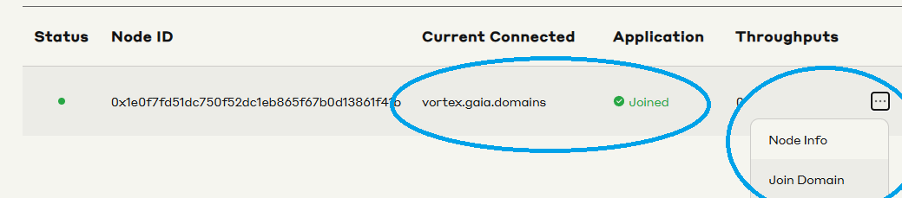
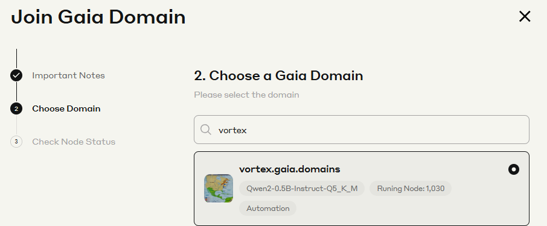

# 가이아넷 CPU 노드 설치 가이드입니다.
가이아넷 디스코드에서 XP 수급률이 좋고 따로 agent랑 채팅칠 필요 없는 노드 그룹으로 가져왔어요.
리눅스 환경이거나 윈도우라면 wsl 사용하셔야 합니다.

# GAIA 노드 설치 가이드 (QWEN2-0.5B)

**마지막 업데이트: 2025년 3월 15일**

## 시스템 요구사항
- Ubuntu 20.04 - 24.04
- 4 코어 CPU
- 8GB RAM

## 기존 Gaia 노드 제거
기존 노드 ID (구버전) 제거가 필요해서 한번쯤 돌려주는게 좋습니다.
```bash
curl -sSfL 'https://github.com/GaiaNet-AI/gaianet-node/releases/latest/download/uninstall.sh' | bash
```

# 이부분은 시스템 업데이트가 되어있다면 건너뛰셔도 됩니다.

## Ubuntu 업데이트 설치
```bash
sudo apt update && sudo apt upgrade -y

sudo apt-get update && sudo apt-get upgrade -y
```

## 서버/VPS/PC/VM 재부팅
```bash
sudo reboot
```

# 기존 gaia 노드가 없고 시스템 업데이트가 되어있다면 여기서부터 시작 하세요.

## Gaia 노드 폴더 생성
```bash
cd $HOME

mkdir gaia-node-101
```

## 생성한 폴더를 기반으로 Gaia 노드 설치
```bash
curl -sSfL 'https://github.com/GaiaNet-AI/gaianet-node/releases/latest/download/install.sh' | bash -s -- --base $HOME/gaia-node-101

source $HOME/.bashrc
```

## QWEN2-0.5B 설정, 포트 8101로 변경, 포트 변경 후 재초기화, Gaia 노드 시작
```bash
gaianet init --base $HOME/gaia-node-101 --config https://raw.githubusercontent.com/GaiaNet-AI/node-configs/main/qwen2-0.5b-instruct/config.json

gaianet config --base $HOME/gaia-node-101 --port 8101

gaianet init --base $HOME/gaia-node-101

sudo lsof -t -i:8101 | xargs kill -9

gaianet start --base $HOME/gaia-node-101
```

## 노드ID와 디바이스ID 확인. Gaia 네트워크 및 원하는 도메인에 Gaia 노드 연결
```bash
gaianet info --base $HOME/gaia-node-101
```
### 위에서 노드 id, 디바이스 id를 적어두시고, 아래 url로 이동하셔서 노드 id, 디바이스 id를 적은 뒤 vortex 도메인에 연결해주면 되겠습니다.
노드 연결: https://www.gaianet.ai/setting/nodes

### 우측 원에서 join domain 선택, 최종적으로는 좌측 원처럼 도메인명과 joined 떠야함.


### vortex 검색 후 선택. 다른 도메인 가입 원하시면 다른곳 검색하셔도 좋습니다.



## 유용한 명령어

### Gaia 노드 중지
```bash
sudo lsof -t -i:8101 | xargs kill -9
```

### Gaia 노드 시작
```bash
gaianet start --base $HOME/gaia-node-101
```
